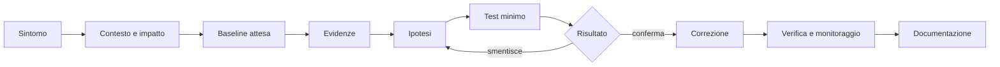

# Manuale operativo del tecnico IT

## Sintesi

Questa guida unisce metodo di troubleshooting, sistemi, rete, identità e comunicazione. Non sostituisce le procedure aziendali: offre un modello mentale riutilizzabile per lavorare con ordine e produrre evidenze.

## Principio operativo

Un tecnico non “prova cose” finché il problema scompare. Riduce l’incertezza con osservazioni, ipotesi falsificabili e modifiche controllate.



## Triage nei primi dieci minuti

1. **Identifica l’impatto:** una persona, un reparto, una sede o un servizio condiviso?
2. **Definisci il sintomo osservabile:** messaggio, timestamp, operazione e risultato atteso.
3. **Controlla i cambiamenti:** aggiornamenti, deploy, policy, certificati, DNS, rete, account.
4. **Verifica la portata:** stesso account su altro dispositivo, altro account sullo stesso dispositivo, altro percorso di rete.
5. **Raccogli evidenza minima:** log rilevante, stato servizio, configurazione effettiva e correlation ID.
6. **Proteggi la produzione:** evita riavvii, reset o cancellazioni se possono distruggere evidenze o ampliare l’impatto.

## Modello a strati

| Strato | Domande | Evidenza |
|---|---|---|
| fisico/virtuale | alimentazione, link, risorse, snapshot? | stato hardware, hypervisor, metriche |
| sistema operativo | boot, disco, memoria, processi, servizi? | Event Viewer, journal, task/process list |
| rete | indirizzo, route, DNS, porta, TLS? | configurazione, lookup, connessione, capture |
| identità | account, token, gruppo, policy, MFA? | logon event, claim, membership, audit |
| applicazione | dipendenze, configurazione, errori, code? | log strutturati, health check, trace |
| dati | schema, permessi, integrità, backup? | query read-only, audit, checksum |

Procedi dal livello più vicino al sintomo, ma verifica sempre le dipendenze sottostanti.

## Windows

### Controlli fondamentali

- versione e patch effettive;
- spazio disco, memoria, CPU e handle;
- processi, servizi e task pianificati;
- Event Viewer: System, Application, Security e log specifici;
- configurazione IP, DNS, proxy e firewall;
- stato account, gruppi, policy e orario;
- integrità dei file solo quando pertinente.

```powershell
Get-ComputerInfo | Select-Object WindowsProductName, WindowsVersion, OsBuildNumber
Get-Volume | Select-Object DriveLetter, FileSystemLabel, SizeRemaining, Size
Get-Process | Sort-Object CPU -Descending | Select-Object -First 10
Get-Service | Where-Object Status -ne Running
Get-WinEvent -LogName System -MaxEvents 30 |
  Select-Object TimeCreated, Id, LevelDisplayName, ProviderName, Message
Get-NetIPConfiguration
Resolve-DnsName example.com
Test-NetConnection example.com -Port 443
```

Non esportare il log Security o dati utente senza necessità, autorizzazione e minimizzazione.

## Linux

### Controlli fondamentali

```bash
uname -a
cat /etc/os-release
df -h
free -h
uptime
systemctl --failed
journalctl -p warning..alert --since "30 minutes ago"
ip address
ip route
resolvectl status
ss -tulpn
```

Leggi prima lo stato; modifica dopo. Per ogni comando con privilegi annota scopo, impatto e rollback.

## Networking end-to-end

Per un problema “il sito non funziona” separa:

1. configurazione locale;
2. raggiungibilità del gateway;
3. risoluzione DNS;
4. connessione TCP;
5. handshake TLS;
6. richiesta HTTP;
7. autenticazione/autorizzazione;
8. dipendenze applicative.

```powershell
Get-NetIPConfiguration
Resolve-DnsName example.com
Test-NetConnection example.com -Port 443 -InformationLevel Detailed
curl.exe -I --max-time 10 https://example.com/
```

Un ping fallito non dimostra che un servizio sia indisponibile; ICMP può essere filtrato. Un ping riuscito non dimostra che DNS, TLS o l’applicazione funzionino.

## Identità e accesso

Prima di “sbloccare” un utente chiarisci:

- identità dichiarata e metodo di verifica;
- account corretto e tenant/dominio;
- stato dell’account e scadenze;
- gruppi e ruoli effettivi;
- policy applicate;
- token/sessioni esistenti;
- orario del dispositivo;
- evento di audit corrispondente.

Non chiedere mai password, codici MFA o token. Le operazioni privilegiate devono essere tracciabili e seguire il processo ufficiale.

## Cambiamenti sicuri

Prima:

- descrivi risultato atteso e rischio;
- salva configurazione o stato necessario al rollback;
- verifica finestra, autorizzazione e comunicazioni;
- limita il cambiamento a una variabile.

Dopo:

- verifica il servizio dal punto di vista dell’utente;
- controlla log e metriche;
- osserva per un periodo adeguato;
- documenta esito, rollback e debito residuo.

## Ticket e note professionali

Un ticket utile contiene:

```text
Impatto:
Sintomo e timestamp:
Ambiente:
Evidenze:
Ipotesi testate:
Modifica autorizzata:
Verifica:
Rischi o follow-up:
```


## Criteri di escalation

Escala quando:

- l’impatto supera il tuo perimetro;
- serve un privilegio non assegnato;
- sono coinvolti sicurezza, dati personali, aspetti legali o continuità;
- mancano evidenze sufficienti per una modifica sicura;
- il workaround aumenta rischio o debito;
- il tempo supera la soglia dell’SLA.

L’escalation deve includere sintesi, impatto, timeline, evidenze e test già eseguiti.

## Procedura operativa
1. Ricostruisci una VM seguendo [[Sistemi operativi e virtualizzazione]].
2. Completa [[02_Cybersecurity/Labs/Lab 001 - Linux|Lab Linux]].
3. Completa [[02_Cybersecurity/Labs/Lab 002 - Networking|Lab Networking]].
4. Automatizza una raccolta diagnostica read-only.
5. Produci un runbook con verifica e rollback.

## Fonti

- Microsoft Learn, Windows documentation: https://learn.microsoft.com/windows/
- Microsoft Learn, PowerShell documentation: https://learn.microsoft.com/powershell/
- freedesktop.org, systemd manual: https://www.freedesktop.org/software/systemd/man/
- IETF, RFC Index: https://www.rfc-editor.org/
