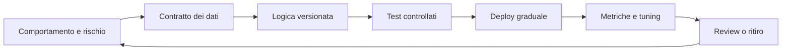

# Threat Hunting e Detection Engineering

## Sintesi

Il threat hunting cerca attivamente comportamenti non ancora rilevati dai controlli. La detection engineering trasforma un comportamento osservabile in una logica testata, distribuita, misurata e mantenuta. Entrambe partono dal rischio e dalla telemetria disponibile, non da una query copiata.

## Ipotesi di hunting

Una buona ipotesi contiene:

```text
Poiché [avversario o condizione] può usare [comportamento]
contro [asset], cercheremo [segnali osservabili]
in [fonti e intervallo], distinguendoli dalla baseline mediante [criterio].
```

Fonti: threat intelligence, incidenti precedenti, cambi infrastrutturali, gap ATT&CK, vulnerabilità esposte e anomalie della baseline. Documenta anche risultati negativi, limiti dei dati e query eseguite.

## Dato prima della regola

Per ogni evento verifica:

- origine, proprietario e metodo di raccolta;
- campi e semantica;
- copertura degli asset;
- latenza, perdita e duplicazione;
- sincronizzazione temporale;
- retention e costo;
- accesso, privacy e integrità;
- trasformazioni tra sorgente e piattaforma.

Telemetria tipica: processi, moduli e script; autenticazioni e token; DNS/proxy; endpoint; firewall e flow; audit cloud; identity SaaS; email; modifiche a configurazioni e privilegi.

MITRE ATT&CK descrive il comportamento avversario con tattiche e tecniche. Non è una checklist di conformità. Dalla versione 18 ATT&CK ha deprecato gli oggetti legacy “Data Sources” in favore di Detection Strategies e Analytics: quando consulti materiale precedente, controlla la versione del modello.

## Specifica di una detection

Ogni detection dovrebbe dichiarare:

- obiettivo e rischio;
- tecnica/comportamento ATT&CK, se pertinente;
- fonti, campi e prerequisiti;
- logica in pseudocodice;
- finestra temporale e raggruppamento;
- esclusioni motivate;
- severità e confidenza;
- test positivi, negativi e varianti;
- risposta dell'analista;
- proprietario, versione e data di revisione.

Esempio concettuale:

```text
Rileva: nuova assegnazione di ruolo privilegiato
Seguita entro 15 minuti da: login da dispositivo non gestito
Raggruppa per: identità e tenant
Escludi: account break-glass solo durante test autorizzati
Contesto: ruolo, attore, IP, device, change ticket
```

## Ciclo detection-as-code



Mantieni query, test, fixture, metadati e runbook insieme. La modifica segue review e changelog; il deploy prevede monitoraggio e rollback.

## Qualità

Misura:

- copertura reale di asset e identità;
- precisione e volume azionabile;
- tempo dal comportamento all'evento e all'alert;
- esiti true/false positive e benign positive;
- tempo di triage;
- regole mai attivate o mai investigate;
- drift di schema e perdita di log;
- percentuale di alert con contesto sufficiente.

Un falso positivo non è sempre un errore: può essere un comportamento benigno ma rischioso da correggere. Non ottimizzare silenziando senza capire.

## Runbook dell'analista

1. Valida completezza e orario dei dati.
2. Ricostruisci sequenza e identità.
3. Arricchisci con asset, criticità, privilegi e change ticket.
4. Cerca lo stesso comportamento su altri soggetti.
5. Classifica evidenze a favore e contro l'ipotesi.
6. Escala con fatti, query e scope riproducibili.
7. Registra esito e feedback sulla detection.

## Fonti ufficiali

- [MITRE ATT&CK — Get Started](https://attack.mitre.org/resources/)
- [MITRE ATT&CK — Data Sources](https://attack.mitre.org/datasources/)

## Collegamenti

- [[Incident Response]]
- [[Indice - Blue Team|Blue Team]]
- [[Manuale operativo di cybersecurity|Manuale operativo di cybersecurity]]
