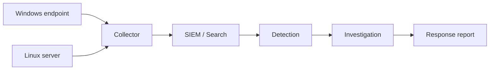

# Lab 006 — Purple team end-to-end

## Sintesi

> [!authorized] LABORATORIO ISOLATO
> Usa soltanto VM personali, dati sintetici e tecniche benigne. Nessuna attività deve uscire dalla rete di laboratorio.

## Obiettivo

Progettare uno scenario, generare telemetria controllata, creare una detection, investigare l’alert, contenere in simulazione e produrre un report completo.

## Architettura minima

- VM Windows endpoint;
- VM Linux server;
- collector/SIEM di laboratorio;
- rete host-only o interna;
- snapshot puliti;
- orologio sincronizzato;
- repository per configurazioni, query ed evidenze sanificate.



## Fase 1 — Scope

Documenta asset, subnet, account, strumenti, orario, attività ammesse, attività vietate, stop condition e criterio di cleanup.

## Fase 2 — Baseline

Raccogli:

- processi e servizi normali;
- utenti e ruoli;
- porte in ascolto;
- sorgenti log attive;
- volume eventi per cinque minuti;
- ritardo tra evento e disponibilità nel SIEM.

## Fase 3 — Evento benigno

Scegli un comportamento osservabile e non distruttivo, per esempio:

- esecuzione di uno script di training firmato con parametro riconoscibile;
- creazione e rimozione di un task chiaramente denominato `NEXUS-LAB`;
- connessione HTTP verso un server interno di test;
- accesso fallito ripetuto con account sintetico entro limiti concordati.

Non usare payload, credential dumping, exploit o persistenza nascosta.

## Fase 4 — Telemetria

Verifica che l’evento appaia nella sorgente, nel collector e nel SIEM. Annota campo, timestamp, normalizzazione e perdita di informazione lungo la pipeline.

## Fase 5 — Detection

Definisci:

```yaml
hypothesis: "Il comportamento di training deve produrre un alert."
data_source: "process creation"
required_fields: [timestamp, host, user, image, command_line]
expected_match: 1
expected_benign_matches: 0
owner: "lab"
```

Implementa query Sigma/KQL o equivalente, poi crea fixture positive e negative.

## Fase 6 — Investigazione

Costruisci timeline:

1. chi ha eseguito;
2. da quale sessione;
3. parent e child process;
4. file e rete correlati;
5. altri host o account coinvolti;
6. evidenze che confermano o smentiscono l’ipotesi.

## Fase 7 — Risposta simulata

Descrivi, senza applicare automaticamente:

- isolamento dell’host;
- disabilitazione sessione/account;
- blocco di indicatore pertinente;
- acquisizione volatile;
- escalation e comunicazione;
- criteri di ripristino.

## Fase 8 — Retest

Correggi telemetria o regola, ripeti evento e casi negativi, misura:

- detection latency;
- precisione;
- campi mancanti;
- costo della query;
- qualità del playbook.

## Deliverable

- diagramma e scope;
- baseline;
- evento di training;
- regola versionata;
- fixture e risultato test;
- timeline;
- report di incidente simulato;
- miglioramenti;
- prova di cleanup e snapshot ripristinato.

## Criterio di superamento

Il lab è superato se un’altra persona può riprodurre l’evento, ottenere lo stesso alert, seguire l’investigazione e comprendere limiti e falsi positivi senza informazioni aggiuntive.

## Collegamenti

- [[Standard laboratorio e raccolta evidenze]]
- [[02_Cybersecurity/Blue Team/Mappatura attacco difesa detection e validazione|Mappatura attacco-difesa]]
- [[02_Cybersecurity/Blue Team/Sigma YARA KQL Suricata Zeek e detection as code|Detection-as-code]]
- [[02_Cybersecurity/Blue Team/Incident Response|Incident Response]]
