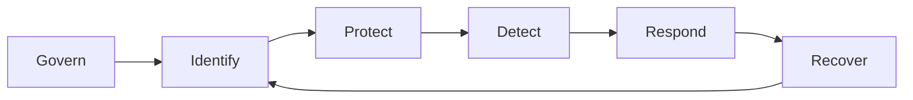
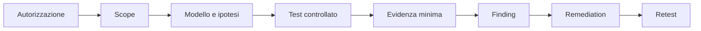

# Manuale operativo di cybersecurity

## Sintesi

La cybersecurity è gestione del rischio basata su asset, identità, comportamenti ed evidenze. Questa guida collega prevenzione, rilevamento, risposta e assessment autorizzato.

> [!important]
> Ogni attività offensiva richiede autorizzazione esplicita, scope, finestra, contatti e regole di ingaggio. In assenza di questi elementi si lavora soltanto in un laboratorio posseduto e isolato.

## Modello unificato



Le funzioni del NIST Cybersecurity Framework 2.0 non sono fasi isolate: governance, identificazione e protezione influenzano la qualità di detection, response e recovery.

## 1. Governare

- definire ruoli, responsabilità e autorità;
- conoscere obblighi, contratti e rischio accettabile;
- gestire fornitori e dipendenze;
- stabilire processi di eccezione, escalation e comunicazione;
- misurare capacità ed esposizione.

Output minimo: registro dei rischi, owner, priorità e decisione tracciabile.

## 2. Conoscere asset e identità

Un asset è hardware, software, servizio, dato, account, certificato o relazione da proteggere.

Per ogni asset critico documenta:

| Campo | Domanda |
|---|---|
| owner | chi decide e approva? |
| funzione | quale processo supporta? |
| esposizione | internet, rete interna, partner? |
| identità | utenti, service account, ruoli? |
| dati | classificazione, retention, backup? |
| dipendenze | DNS, IdP, database, code, cloud? |
| telemetria | quali eventi dimostrano cosa accade? |
| recovery | come e quanto rapidamente si ripristina? |

Senza inventario e ownership, vulnerabilità e alert non possono essere prioritizzati correttamente.

## 3. Proteggere

Baseline:

- MFA resistente al phishing dove possibile;
- least privilege e separazione dei compiti;
- patch e configurazioni sicure;
- segmentazione e controllo dei flussi;
- backup protetti, testati e separati;
- secure software lifecycle;
- gestione dei segreti;
- formazione collegata ai rischi reali.

Un controllo è utile solo se è implementato, osservabile e verificato.

## 4. Rilevare

Parti dalle domande:

1. quale comportamento dannoso o anomalo vuoi osservare?
2. su quale asset e identità?
3. quale evento lo rappresenta?
4. il sensore raccoglie campi, orario e contesto sufficienti?
5. come testi la detection senza danneggiare l’ambiente?

Telemetria ad alto valore:

- autenticazioni, sessioni e privilegi;
- creazione processi e script;
- servizi, task e persistenza;
- DNS, proxy, firewall e flussi;
- endpoint e file rilevanti;
- audit cloud, SaaS e identity provider;
- eventi applicativi e di autorizzazione.

MITRE ATT&CK offre un linguaggio per comportamenti avversari, non una checklist di conformità. Dalla versione 18, le vecchie “Data Sources” sono deprecate: verifica sempre il modello ATT&CK corrente prima di progettare mapping e coverage.

## 5. Rispondere e recuperare

NIST SP 800-61 Rev. 3 integra la risposta agli incidenti nel CSF 2.0. La preparazione non è una fase eseguita una volta: ruoli, asset, log, backup e comunicazioni devono esistere prima dell’incidente.

Durante l’incidente:

1. valida e classifica;
2. costruisci timeline e scope;
3. preserva evidenze;
4. contiene in modo proporzionato;
5. rimuovi causa e persistenza;
6. ripristina da stato noto;
7. monitora;
8. aggiorna rischi, controlli e runbook.

Consulta [[Blue Team/Incident Response]].

## Assessment ed ethical hacking autorizzato



### Prima

- identifica owner e target esatti;
- documenta esclusioni e tecniche vietate;
- stabilisci limiti di carico e stop condition;
- concorda trattamento delle evidenze;
- prepara contatto di emergenza e rollback.

### Durante

- usa la tecnica meno invasiva sufficiente;
- registra timestamp, comando, target e risultato;
- non espandere lo scope per curiosità;
- minimizza dati visualizzati o conservati;
- interrompi se compare rischio non previsto.

### Dopo

- rimuovi artefatti di test;
- conserva soltanto evidenze necessarie;
- redigi finding riproducibile;
- proponi remediation proporzionata;
- esegui retest sul controllo, non solo sul sintomo.

## Web e Application Security

OWASP Top 10:2025 evidenzia:

1. Broken Access Control;
2. Security Misconfiguration;
3. Software Supply Chain Failures;
4. Cryptographic Failures;
5. Injection;
6. Insecure Design;
7. Authentication Failures;
8. Software or Data Integrity Failures;
9. Security Logging and Alerting Failures;
10. Mishandling of Exceptional Conditions.

Usa la Top 10 come documento di awareness; per requisiti verificabili usa OWASP ASVS.

## Anatomia di un finding

```text
Titolo:
Asset e scope:
Condizione osservata:
Impatto plausibile:
Prerequisiti:
Passi di riproduzione minimizzati:
Evidenza:
Causa:
Remediation:
Priorità e motivazione:
Esito del retest:
```

La severità non è solo CVSS: considera esposizione, valore dell’asset, controlli compensativi e fattibilità nel contesto.

## Laboratorio sicuro

- rete isolata e nessun bridge verso produzione;
- target deliberatamente vulnerabili o sistemi propri;
- snapshot e reset verificati;
- dati fittizi;
- logging attivo;
- piano di cleanup;
- evidenza e retrospettiva.

Percorso: [[Labs/Lab 001 - Linux]] → [[Labs/Lab 002 - Networking]] → [[Labs/Lab 003 - Nmap]] → [[Labs/Lab 004 - Wireshark]] → [[Labs/Lab 005 - Web]].

## Fonti verificate

- NIST Cybersecurity Framework 2.0: https://www.nist.gov/cyberframework
- NIST SP 800-61 Rev. 3, aprile 2025: https://csrc.nist.gov/pubs/sp/800/61/r3/final
- MITRE ATT&CK, Get Started: https://attack.mitre.org/resources/
- MITRE ATT&CK, Data Sources e avviso v18: https://attack.mitre.org/datasources/
- OWASP Top 10:2025: https://owasp.org/Top10/
- OWASP ASVS: https://owasp.org/www-project-application-security-verification-standard/
