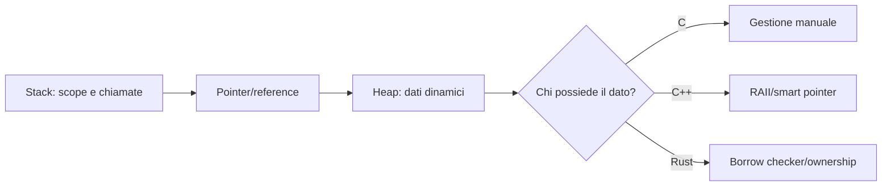

# C C++ e Rust - esempi sistemi

## C: leggere un intero in modo controllato

```c
#include <errno.h>
#include <limits.h>
#include <stdio.h>
#include <stdlib.h>
#include <string.h>

int parse_int(const char *text, int *output) {
    char *end = NULL;
    errno = 0;
    long value = strtol(text, &end, 10);

    if (errno != 0 || end == text || *end != '\0') return 0;
    if (value < INT_MIN || value > INT_MAX) return 0;

    *output = (int)value;
    return 1;
}

int main(void) {
    char buffer[64];
    if (fgets(buffer, sizeof buffer, stdin) == NULL) return 1;

    buffer[strcspn(buffer, "\r\n")] = '\0';
    int value = 0;
    if (!parse_int(buffer, &value)) {
        fputs("invalid integer\n", stderr);
        return 2;
    }
    printf("%d\n", value);
    return 0;
}
```

Evita `gets`, buffer senza limite e conversioni non controllate.

## C++: RAII e file

```cpp
#include <fstream>
#include <stdexcept>
#include <string>

std::size_t count_non_empty_lines(const std::string& path) {
    std::ifstream input(path);
    if (!input) {
        throw std::runtime_error("cannot open input");
    }

    std::size_t count = 0;
    for (std::string line; std::getline(input, line);) {
        if (!line.empty()) {
            ++count;
        }
    }
    return count;
}
```

Lo stream chiude il file quando esce dallo scope. Preferisci container e smart pointer a ownership manuale.

## Rust: Result e parsing

```rust
use std::{fs, num::ParseIntError, path::Path};

fn read_numbers(path: &Path) -> Result<Vec<i64>, Box<dyn std::error::Error>> {
    let content = fs::read_to_string(path)?;
    content
        .lines()
        .filter(|line| !line.trim().is_empty())
        .map(|line| line.trim().parse::<i64>())
        .collect::<Result<Vec<_>, ParseIntError>>()
        .map_err(Into::into)
}

fn sum_checked(values: &[i64]) -> Option<i64> {
    values.iter().try_fold(0_i64, |total, value| {
        total.checked_add(*value)
    })
}
```

`Result` rappresenta errori recuperabili; `Option` rappresenta assenza. L'overflow viene gestito esplicitamente.

## Toolchain

```bash
cc -Wall -Wextra -Wpedantic -Werror program.c -o program
c++ -std=c++20 -Wall -Wextra -Wpedantic program.cpp -o program
cargo fmt --check
cargo clippy -- -D warnings
cargo test
```

Durante sviluppo e test usa sanitizer quando disponibili:

```bash
cc -fsanitize=address,undefined -g program.c -o program
```

## Modello visivo della memoria



## Collegamenti

- [[Indice - Esempi di programmazione]]
- [[03_Sviluppo/Linguaggi/C e C++|C e C++]]
- [[03_Sviluppo/Linguaggi/Rust|Rust]]
- [[02_Cybersecurity/Reverse Engineering/Indice - Reverse Engineering|Reverse Engineering]]
