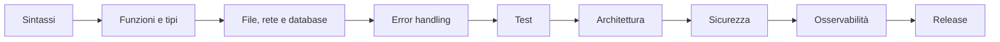

# Esempi di programmazione

- [[Progetti multipiattaforma esempi e verifiche]]

Gli esempi sono piccoli, eseguibili e orientati a validazione, error handling, test e sicurezza. Non copiarli senza comprenderne input, output e limiti.

## Fondamenti

- [[Fondamenti confrontati]]
- [[Pattern di progetto e debugging]]

## Linguaggi principali

- [[Python - esempi pratici]]
- [[JavaScript e TypeScript - esempi pratici]]
- [[Java C Sharp e Go - esempi backend]]
- [[C C++ e Rust - esempi sistemi]]
- [[SQL e automazione - esempi pratici]]
- [[Kotlin PHP Ruby e Swift - esempi rapidi]]

## Progressione

## Regola di pratica

Per ogni esempio:

1. prevedi l'output;
2. eseguilo;
3. cambia un input;
4. provoca un errore;
5. aggiungi un test;
6. misura o osserva;
7. spiega il rischio principale.

## Collegamenti

- [[03_Sviluppo/Linguaggi/Indice - Linguaggi|Mappa dei linguaggi]]
- [[Testing e qualita del software|Testing e qualità]]
- [[Sicurezza del software|Sicurezza del software]]
