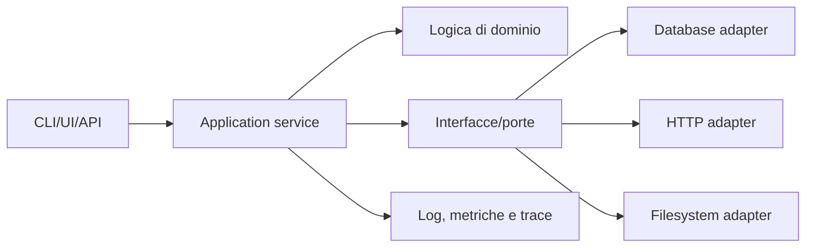
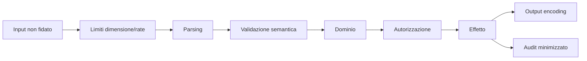
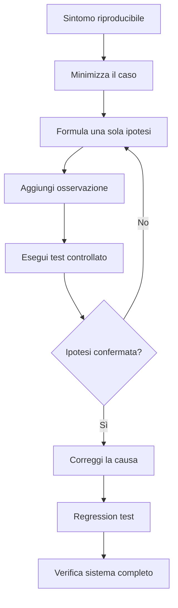
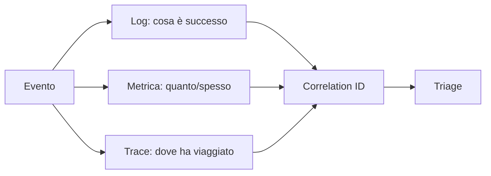

# Pattern di progetto e debugging

## Struttura applicativa minima



La logica di dominio non dovrebbe dipendere direttamente da UI, database o rete. I confini diventano sostituibili e testabili.

## Pipeline input-output



## Debugging scientifico



## Checklist del bug report

- ambiente, versione e configurazione;
- input minimo;
- risultato atteso e osservato;
- timestamp e correlation ID;
- stack trace/log minimizzati;
- frequenza;
- ultimo stato noto funzionante;
- workaround e impatto.

## Test per livello

| Livello | Cosa protegge | Esempio |
|---|---|---|
| unit | regole locali | normalizzazione e calcolo |
| property/fuzz | invarianti e input ampio | parser non va in crash |
| integration | confini | database, file, API |
| contract | compatibilità | schema request/response |
| end-to-end | percorso critico | login → azione → audit |
| security | abuso e trust boundary | authz, injection, rate |

## Error handling

Un errore utile contiene operazione, risorsa non sensibile, causa e azione successiva. L'utente vede un messaggio stabile; log interni possono avere dettagli, ma non segreti.

```text
Codice: CONFIG_NOT_FOUND
Messaggio utente: configurazione non disponibile
Contesto log: file atteso, ambiente, correlation ID
Recovery: crea configurazione o seleziona profilo
```

## Osservabilità



## Collegamenti

- [[Indice - Esempi di programmazione]]
- [[Testing e qualita del software|Testing]]
- [[Sicurezza del software|Sicurezza del software]]
- [[02_Cybersecurity/Fondamenti/Threat Modeling|Threat Modeling]]
