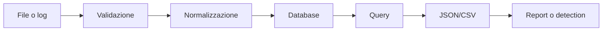

# SQL e automazione - esempi pratici

## Schema con vincoli

```sql
CREATE TABLE events (
    id INTEGER PRIMARY KEY,
    occurred_at TIMESTAMP NOT NULL,
    level TEXT NOT NULL CHECK (level IN ('INFO', 'WARNING', 'ERROR')),
    source TEXT NOT NULL,
    message TEXT NOT NULL
);

CREATE INDEX idx_events_time_level
    ON events(occurred_at, level);
```

## Query parametrizzata

```sql
SELECT level, COUNT(*) AS event_count
FROM events
WHERE occurred_at >= :from_time
  AND source = :source
GROUP BY level
ORDER BY event_count DESC;
```

I parametri vengono associati dal driver; non sostituirli con concatenazione di stringhe.

## Window function

```sql
SELECT
    occurred_at,
    level,
    source,
    COUNT(*) OVER (
        PARTITION BY source
        ORDER BY occurred_at
        ROWS BETWEEN 9 PRECEDING AND CURRENT ROW
    ) AS rolling_event_count
FROM events;
```

## Bash: inventario con hash

```bash
#!/usr/bin/env bash
set -Eeuo pipefail

root=${1:?uso: inventory.sh DIRECTORY}
[[ -d "$root" ]] || { printf 'directory non valida\n' >&2; exit 2; }

find "$root" -type f -print0 |
  while IFS= read -r -d '' file; do
    sha256sum -- "$file"
  done
```

Non attraversare directory non autorizzate e proteggi l'inventario se contiene percorsi sensibili.

## PowerShell: inventario JSON

```powershell
param(
    [Parameter(Mandatory)]
    [string]$Root
)

$resolved = (Resolve-Path -LiteralPath $Root).Path
$items = Get-ChildItem -LiteralPath $resolved -Recurse -File |
    ForEach-Object {
        [pscustomobject]@{
            Path = $_.FullName.Substring($resolved.Length).TrimStart('\')
            Bytes = $_.Length
            Sha256 = (Get-FileHash -LiteralPath $_.FullName -Algorithm SHA256).Hash
        }
    }

$items | ConvertTo-Json -Depth 4
```

## Pipeline visuale



## Collegamenti

- [[Indice - Esempi di programmazione]]
- [[03_Sviluppo/Linguaggi/SQL|SQL]]
- [[03_Sviluppo/Linguaggi/Shell e PowerShell|Shell e PowerShell]]
- [[05_Risorse/Riferimenti operativi/Comandi SQL|Comandi SQL]]
