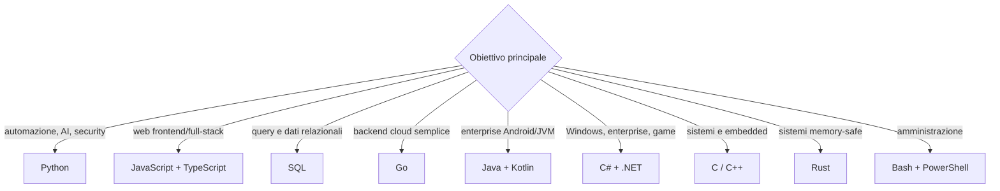

# Linguaggi di programmazione

Questa è la mappa principale. Non serve imparare ogni linguaggio: scegli una direzione, studia bene i fondamenti e usa le altre schede come riferimento.

## Tassonomia dei linguaggi

1. [[Fondamenti di programmazione]]
2. [[Python]] per automazione, dati e sicurezza
3. [[JavaScript e TypeScript]] per web full-stack
4. [[SQL]] e modellazione dei dati
5. Un linguaggio di sistemi: [[C e C++]] oppure [[Rust]]
6. Un ecosistema enterprise/mobile: [[Java e Kotlin]], [[C Sharp e dotNET]], [[Go]], [[Swift]]

## Scegliere il linguaggio

## Matrice pratica

| Linguaggio | Primo uso | Punti forti | Attenzione |
|---|---|---|---|
| Python | automazione, dati, security | leggibilità, ecosistema | packaging, tipi runtime |
| TypeScript | web e Node | stesso ecosistema client/server | dipendenze, asincronia |
| SQL | storage e analisi | query dichiarative | concorrenza, injection |
| Go | servizi e tooling | binario, concorrenza semplice | error handling esplicito |
| Java/Kotlin | backend, Android | JVM, tooling enterprise | complessità dell'ecosistema |
| C# | .NET, desktop, backend | type system, tooling | runtime ed ecosistema |
| C/C++ | sistemi, performance | controllo e interoperabilità | memory safety |
| Rust | sistemi e CLI | memory safety senza GC | curva di apprendimento |
| Bash/PowerShell | orchestrazione | vicinanza al sistema | quoting e input non fidato |

## Altri linguaggi importanti

- [[PHP e Ruby]] — applicazioni web e codebase esistenti
- [[Shell e PowerShell]] — automazione di sistemi
- [[Linguaggi funzionali e scientifici]] — Scala, Elixir, Haskell, R, Julia, MATLAB
- [[Assembly e WebAssembly]] — reverse engineering, sistemi e browser
- [[Toolchain native C C++ Rust Assembly e debugging]] — compilazione, sanitizer e debugger
- [[Runtime memoria concorrenza tipi e debugging tra linguaggi]] — internals trasversali e confronto dei runtime
- [[03_Sviluppo/Esempi di programmazione/Indice - Esempi di programmazione|Esempi comparati e progetti]]

## Conoscenze trasversali

- [[Algoritmi e strutture dati]]
- [[Paradigmi e design pattern]]
- [[Testing e qualita del software]]
- [[Sicurezza del software]]
- [[01_Informatica/Git e GitHub/Indice - Git e GitHub|Git e GitHub]]
- [[03_Sviluppo/APIs/Indice - APIs|API]]
