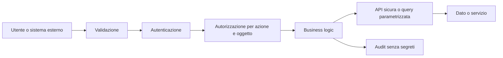

# Sicurezza del software

## Sintesi

La sicurezza è una proprietà del ciclo di vita. Parte da asset, attori, confini di fiducia e casi di abuso; continua con implementazione, verifica, distribuzione, telemetria e risposta.

## Ciclo sicuro

Requisiti e asset → threat model → design least privilege → implementazione → review e analisi statica → test dinamici/fuzzing → dipendenze e SBOM → deploy hardenizzato → monitoraggio e risposta.

## Baseline OWASP Top 10:2025

Usa la Top 10 come strumento di consapevolezza, non come checklist completa:

1. Broken Access Control
2. Security Misconfiguration
3. Software Supply Chain Failures
4. Cryptographic Failures
5. Injection
6. Insecure Design
7. Authentication Failures
8. Software or Data Integrity Failures
9. Security Logging and Alerting Failures
10. Mishandling of Exceptional Conditions

Per requisiti verificabili usa OWASP ASVS; per le API aggiungi OWASP API Security Top 10.

## Controlli per confine

### Input e output

Valida lato server tipo, formato, lunghezza, range, cardinalità e relazione tra campi. Normalizza una sola volta e rifiuta ambiguità. Codifica l'output per il contesto HTML, URL, JavaScript, SQL o shell. Non costruire query o comandi concatenando input.

### Identità e autorizzazione

Autenticazione e autorizzazione sono distinte. Controlla ogni azione e ogni oggetto lato server, deny by default, usando identità e tenant espliciti. Testa accessi orizzontali, verticali e cross-tenant.

### Dati e crittografia

Classifica i dati, minimizza raccolta e retention, usa primitive e protocolli standard, gestisci chiavi separatamente dai dati. Password con KDF adatta; token brevi, con issuer, audience, expiry e revoca coerenti.

### Dipendenze e supply chain

Riduci dipendenze, blocca versioni in modo riproducibile, verifica provenienza e vulnerabilità, proteggi pipeline e artifact, conserva SBOM e piano di aggiornamento. Uno scanner non dimostra che una dipendenza sia sicura.

### Segreti

Mai in repository, immagini, prompt, log o file distribuiti. Usa un secret manager, privilegi minimi, rotazione e revoca. Considera compromesso ogni segreto esposto.

### Errori e condizioni eccezionali

Timeout, limiti, backpressure, circuit breaker e cancellazione devono essere progettati. Fallisci in modo sicuro e consistente; non restituire stack trace o dettagli interni. Definisci cosa succede in caso di disco pieno, coda satura, dipendenza lenta e risposta parziale.

### Logging e alert

Registra decisioni di sicurezza, cambi privilegi, accessi sensibili e fallimenti rilevanti con identità, oggetto, esito e correlation ID. Non registrare password, token, chiavi o dati personali non necessari. Un log senza proprietario, retention e alert non è un controllo.

## Checklist di review

- asset e confini di fiducia documentati;
- casi di abuso e autorizzazione verificati;
- parser, upload, URL e redirect limitati;
- operazioni remote con timeout e idempotenza;
- dipendenze, build e artifact controllati;
- segreti assenti da codice e log;
- errori non causano fail-open;
- test negativi e fuzzing dove utile;
- telemetria azionabile;
- rollback e risposta a incidenti previsti.

## Fonti ufficiali

- [OWASP Top 10:2025](https://owasp.org/Top10/)
- [OWASP ASVS](https://owasp.org/www-project-application-security-verification-standard/)
- [NIST Secure Software Development Framework](https://csrc.nist.gov/projects/ssdf)

## Collegamenti

- [[Esempi di programmazione/Pattern di progetto e debugging|Pattern e debugging]]
- [[02_Cybersecurity/Fondamenti/Threat Modeling|Threat Modeling]]
- [[02_Cybersecurity/Web Security/Indice - Web Security|Web Security]]
