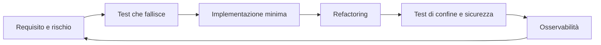

# Testing e qualita del software

## Sintesi

La qualità non coincide con la coverage: significa comportamento corretto, comprensibile, sicuro, osservabile e modificabile. Ogni test deve proteggere un rischio o un contratto.

## Portafoglio dei test

| Livello | Protegge | Caratteristiche |
|---|---|---|
| unit | regole e casi limite | rapido, deterministico, senza I/O |
| integration | database, filesystem, code e API | dipendenze reali o equivalenti |
| contract | compatibilità tra componenti | schema, status, errori, versioni |
| end-to-end | pochi percorsi utente critici | costoso, più fragile |
| property-based | proprietà su molti input | ottimo per trasformazioni/parser |
| fuzz | crash e stati inattesi | input ostili, budget limitato |
| performance | latenza, throughput, memoria | ambiente e soglie controllati |
| security | abuso, authz, injection, rate limit | casi negativi obbligatori |

Usa una piramide pragmatica: molti test economici, integrazione sui confini e pochi E2E ad alto valore.

## Anatomia di un buon test

- nome che descrive scenario e risultato;
- Arrange/Act/Assert leggibile;
- una causa di fallimento principale;
- dati minimi ma realistici;
- niente dipendenza da ordine, ora reale o rete non controllata;
- verifica dell'output osservabile, non dell'implementazione interna;
- messaggio diagnostico utile.

Non mockare il codice che vuoi realmente verificare. Usa fakes per porte controllate e test di contratto per assicurare che fake e adapter reale si comportino allo stesso modo.

## Strategia per una nuova funzione

1. Trasforma il requisito in esempi e proprietà.
2. Elenca happy path, errori, confini e abuso.
3. Scrivi il test più piccolo che fallisce per la ragione corretta.
4. Implementa il minimo necessario.
5. Refactor mantenendo i test verdi.
6. Verifica il confine reale.
7. Aggiungi telemetria per ciò che i test non possono prevedere.

## Test di sicurezza essenziali

- accesso orizzontale e verticale negato;
- input fuori formato, enorme, duplicato o ambiguo;
- query e comandi non interpretabili come codice;
- token scaduto, revocato o con audience errata;
- rate limit e timeout;
- errore esterno senza perdita di consistenza;
- log senza segreti;
- upload con tipo, dimensione, nome e contenuto non validi.

## Quality gate

Prima del merge:

- formatter e lint puliti;
- type/static analysis senza nuove criticità;
- test ripetibili e indipendenti;
- dipendenze e segreti controllati;
- review sui rischi, non solo sullo stile;
- migrazione e rollback definiti;
- log, metriche e trace utili;
- documentazione aggiornata.

Coverage, complessità e mutation score sono segnali. Una soglia non sostituisce la revisione dei casi mancanti.

## Diagnosi di test instabili

Classifica il flake: tempo, concorrenza, stato condiviso, rete, ordine, casualità o risorse insufficienti. Conserva seed e artefatti, correggi la causa e non mascherarla con retry illimitati.

## Collegamenti

- [[Esempi di programmazione/Pattern di progetto e debugging|Pattern e debugging]]
- [[Sicurezza del software]]
