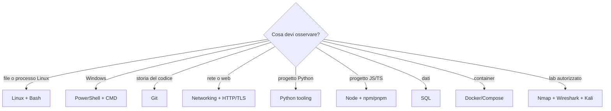

# Catalogo dei comandi

## Nuovi atlanti professionali

- [[Riferimenti operativi/Amministrazione multipiattaforma|Amministrazione multipiattaforma]]
- [[Riferimenti operativi/Comandi cloud Kubernetes Terraform e Ansible|Cloud, Kubernetes e Infrastructure as Code]]
- [[Riferimenti operativi/Comandi per assessment autorizzati|Ethical hacking autorizzato]]
- [[Riferimenti operativi/Comandi di triage DFIR|DFIR e triage]]

Questa pagina indica **dove cercare**. Nessuna nota può contenere ogni opzione di ogni programma: per la sintassi completa usa `--help`, `man`, `Get-Help` e documentazione ufficiale.

## Scelta rapida



## Sistemi e shell

| Ambito | Riferimento |
|---|---|
| Linux | [[01_Informatica/Linux/Comandi Linux\|Comandi Linux]] |
| Bash | [[Riferimenti operativi/Comandi Bash\|Comandi Bash]] |
| PowerShell | [[Riferimenti operativi/Comandi PowerShell\|Comandi PowerShell]] |
| Windows CMD/amministrazione | [[Riferimenti operativi/Windows CMD e amministrazione\|Windows Commands]] |
| WSL | [[01_Informatica/Linux/WSL\|WSL]] |
| accesso remoto | [[01_Informatica/Linux/SSH\|SSH]] |

## Development

| Ambito | Riferimento |
|---|---|
| Git | [[Riferimenti operativi/Comandi Git\|Comandi Git]] |
| Python, venv, pip e test | [[Riferimenti operativi/Comandi strumenti Python\|Python Tooling]] |
| Node, npm e pnpm | [[Riferimenti operativi/Comandi Node npm e pnpm\|Node Tooling]] |
| SQL e client database | [[Riferimenti operativi/Comandi SQL\|Comandi SQL]] |
| Docker e Compose | [[Riferimenti operativi/Comandi Docker e Compose\|Docker Commands]] |

## Rete, web e sicurezza

| Ambito | Riferimento |
|---|---|
| diagnostica rete | [[01_Informatica/Networking/Comandi Networking - Tech\|Comandi Networking]] |
| HTTP, API, DNS e TLS | [[Riferimenti operativi/Comandi HTTP API e TLS\|HTTP API e TLS]] |
| Nmap autorizzato | [[Riferimenti operativi/Comandi Nmap\|Comandi Nmap]] |
| Wireshark/tshark | [[Riferimenti operativi/Comandi Wireshark\|Comandi Wireshark]] |
| workstation Kali | [[02_Cybersecurity/Kali Linux/Comandi Kali\|Comandi Kali]] |

## Metodo prima del comando


## Comandi di aiuto

```text
Linux/macOS: comando --help
Linux/macOS: man comando
PowerShell: Get-Help Comando -Full
PowerShell: Get-Command *termine*
Python: python -m modulo --help
Node: npm help comando
Docker: docker comando --help
Git: git help comando
```

Per comandi distruttivi, di rete o amministrativi annota sempre prerequisiti, target, impatto e rollback.
